### Facebook based mobile application

This project is a mobile application which actually looks like #Facebook

If you face any problem with this project or repositories just contact with me on 
- facebook: www.facebook.com/munemuddin.engineer
- instagram: www.instagram.com/munemsarker

.

## Screenshots

<table border>
    <tr>
        <th style="text-align:center">Home</th>
        <th style="text-align:center">Story</th>
        <th style="text-align:center">Search</th>
    </tr>
    <tr>
        <td>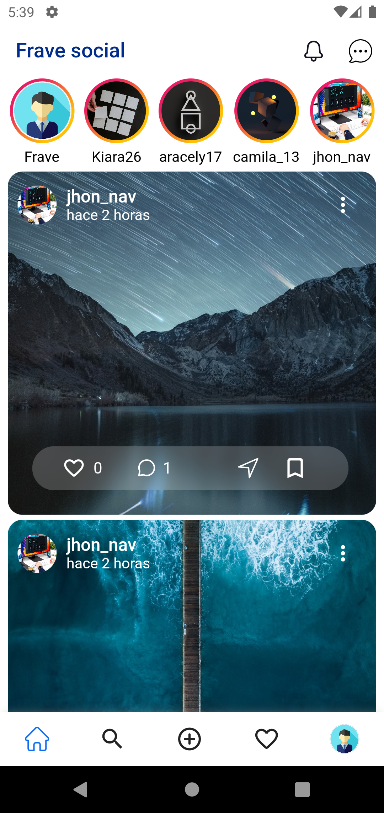</td>
        <td>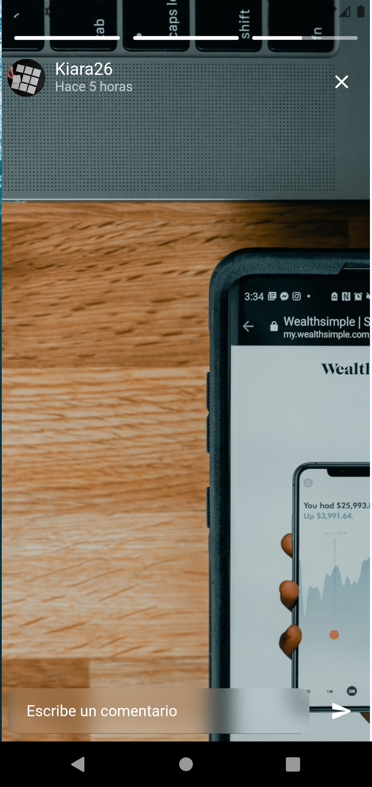</td>
        <td></td>
    <tr>
</table>

<table border>
    <tr>
        <th style="text-align:center">Search | view Photo</th>
        <th style="text-align:center">Search User</th>
        <th style="text-align:center">Profile another user</th>
    </tr>
    <tr>
        <td>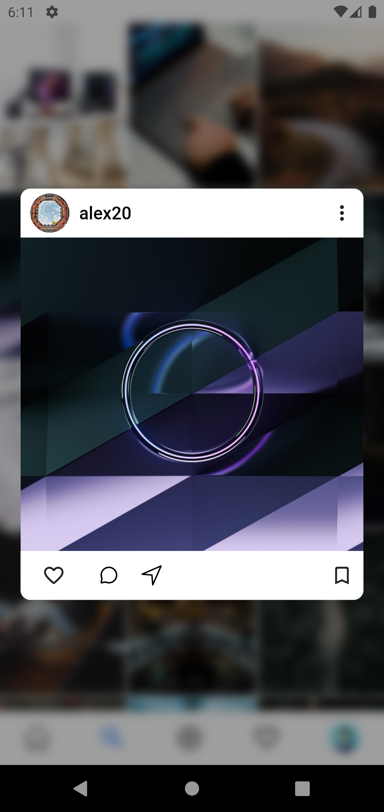</td>
        <td>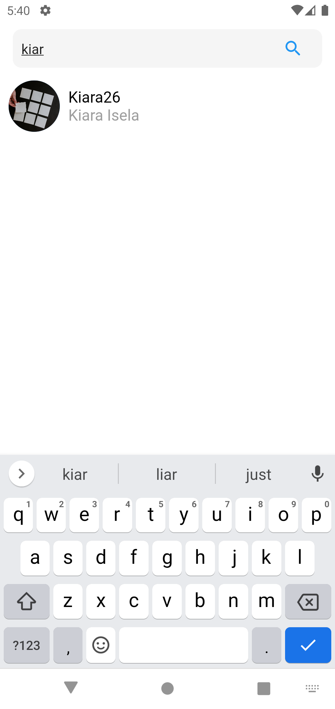</td>
        <td>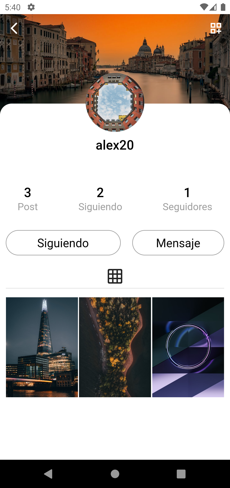</td>
    <tr>
</table>

<table border>
    <tr>
        <th style="text-align:center">Add New post</th>
        <th style="text-align:center">Add new Post</th>
        <th style="text-align:center">Privacy post</th>
    </tr>
    <tr>
        <td></td>
        <td>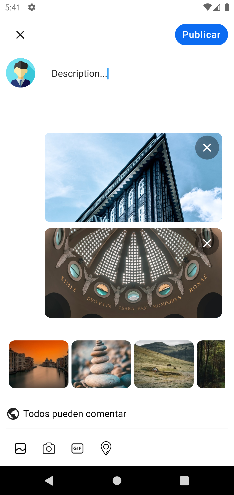</td>
        <td>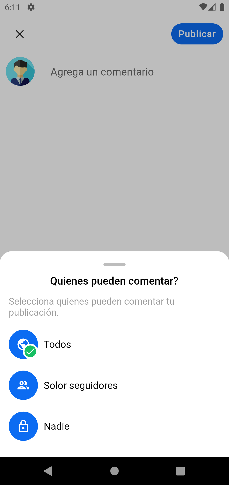</td>
    <tr>
</table>

<table border>
    <tr>
        <th style="text-align:center">Activity</th>
        <th style="text-align:center">Profile</th>
        <th style="text-align:center">Profile - Saved</th>
    </tr>
    <tr>
        <td>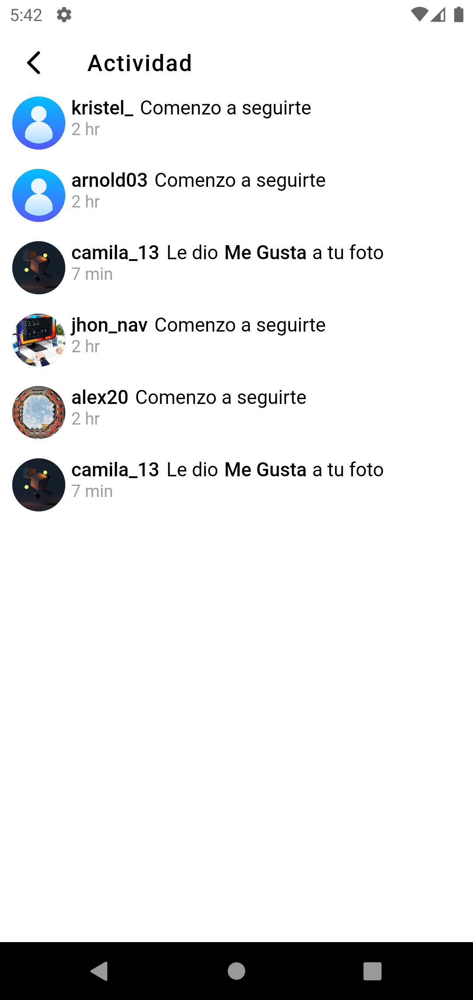</td>
        <td>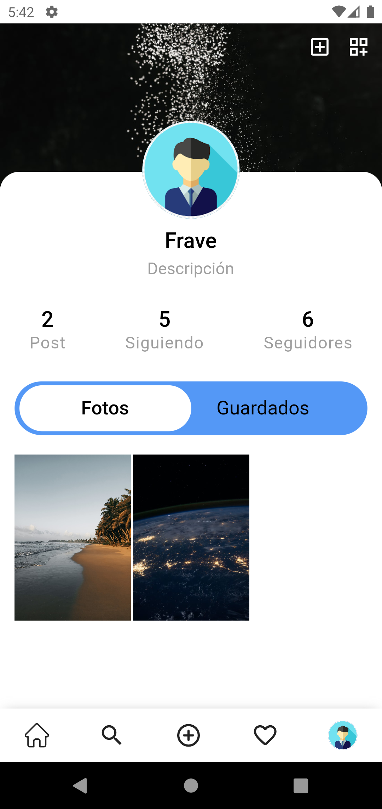</td>
        <td>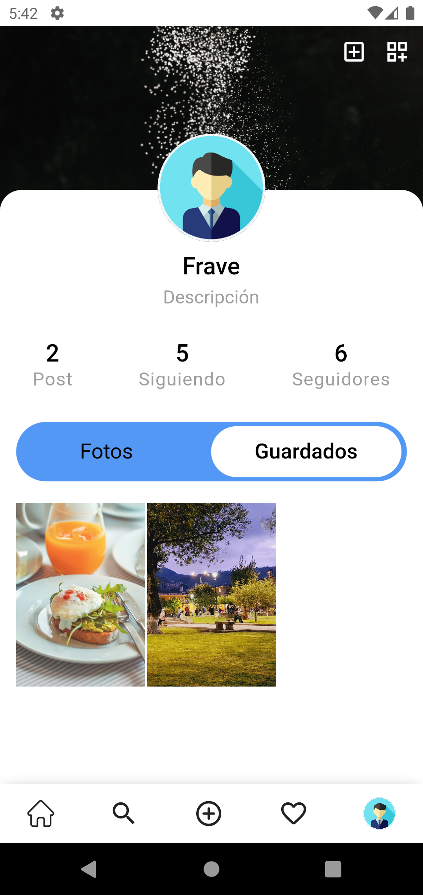</td>
    <tr>
</table>

<table border>
    <tr>
        <th style="text-align:center">Following</th>
        <th style="text-align:center">Followers</th>
        <th style="text-align:center">Modal Settings</th>
    </tr>
    <tr>
        <td>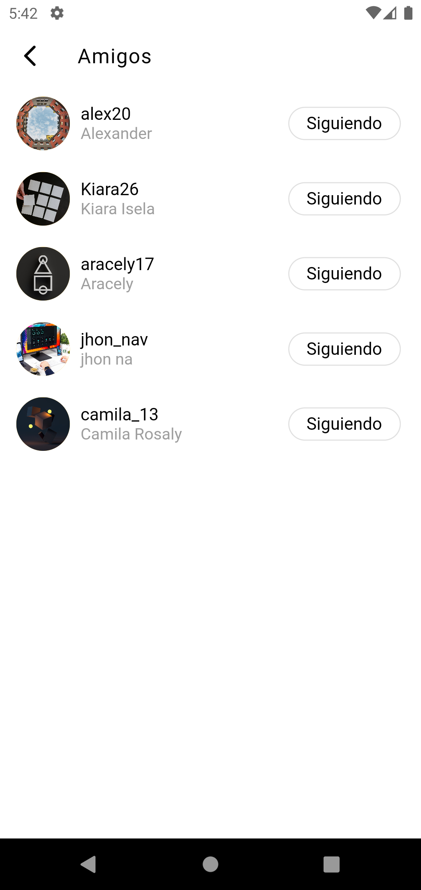</td>
        <td>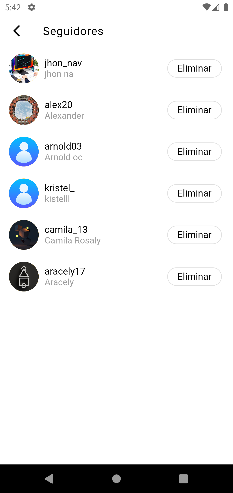</td>
        <td>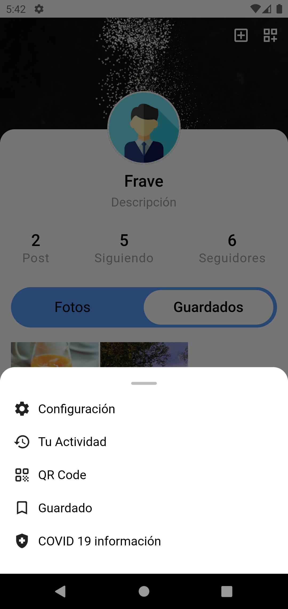</td>
    <tr>
</table>

<table border>
    <tr>
        <th style="text-align:center">Settings</th>
        <th style="text-align:center">Privacy</th>
        <th style="text-align:center">Security</th>
    </tr>
    <tr>
        <td>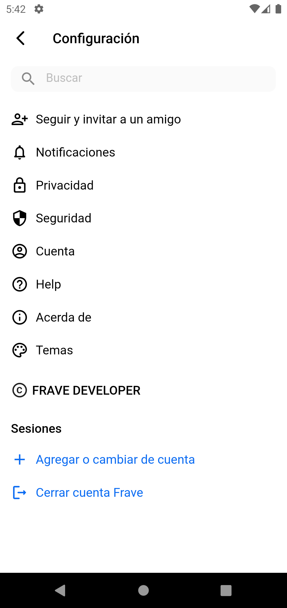</td>
        <td>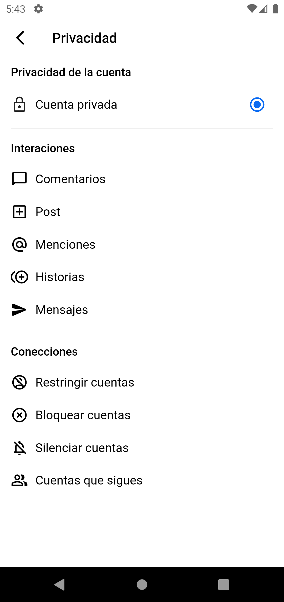</td>
        <td>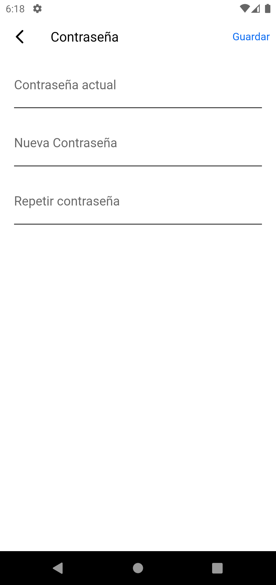</td>
    <tr>
</table>

<table border>
    <tr>
        <th style="text-align:center">Account</th>
        <th style="text-align:center">List Messages</th>
        <th style="text-align:center">Chat</th>
    </tr>
    <tr>
        <td>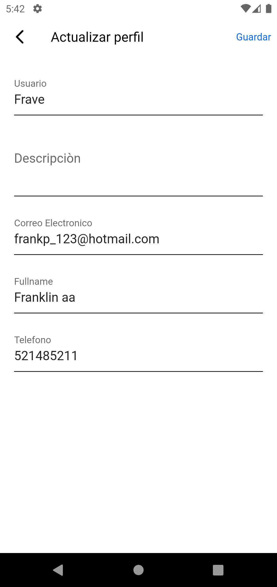</td>
        <td>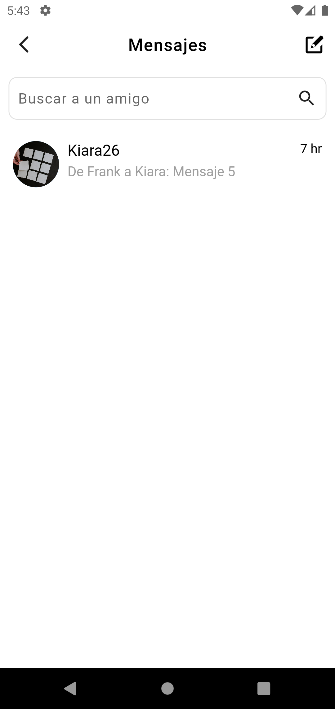</td>
        <td></td>
    <tr>
</table>
